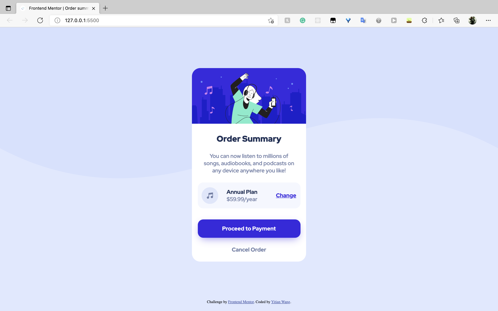
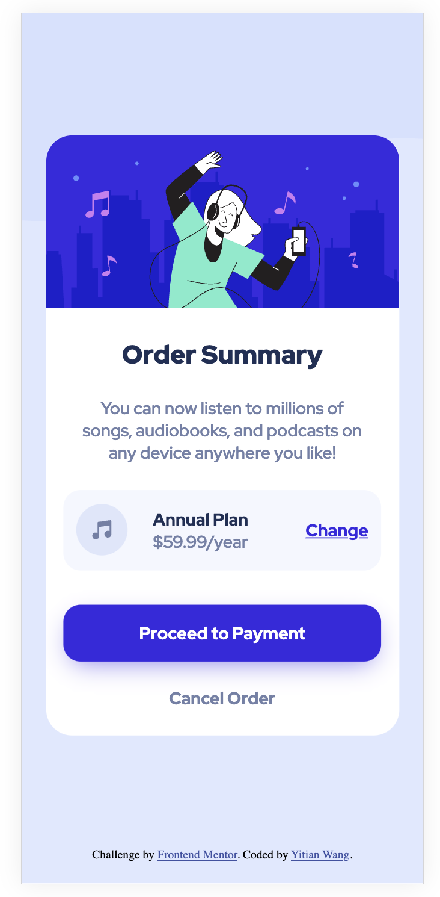

# Frontend Mentor - Order summary card solution

This is a solution to the [Order summary card challenge on Frontend Mentor](https://www.frontendmentor.io/challenges/order-summary-component-QlPmajDUj). Frontend Mentor challenges help you improve your coding skills by building realistic projects. 

## Table of contents

- [Overview](#overview)
  - [The challenge](#the-challenge)
  - [Screenshot](#screenshot)
  - [Links](#links)
- [My process](#my-process)
  - [Built with](#built-with)
  - [What I learned](#what-i-learned)
  - [Continued development](#continued-development)
  - [Useful resources](#useful-resources)
- [Author](#author)

**Note: Delete this note and update the table of contents based on what sections you keep.**

## Overview

### The challenge

Users should be able to:

- See hover states for interactive elements on pointer device
- See active states for interactive elements on touch device

### Screenshot




### Links

- Solution URL: [View my solution on GitHub](https://github.com/yitianwang18/order-summary-component)
- Live Site URL: [View live site on my GitHub Pages](https://yitianwang18.github.io/order-summary-component)

## My process

### Built with

- Semantic HTML5 markup
- CSS custom properties
- Flexbox
- Mobile-first workflow

### What I learned

Knowing that the website is inheriently responsive without css, I'm able to focus on how to add css rules without breaking its responsiveness instead of making a layout then try to fix it. I found Generally avoiding fix sizes like px and favoring max/min - width/height over fixed width and height can avoid a lot of issues.

```css
main {
  min-height: 95vh;
}
```

I used this rule to span the entire main section to 95% of viewport.
When the viewport shrink and the main section cannot hold its content, it simply falls back to a its original content-area height without overflow;

```css
main {
    /* centering card inside main */
    display: flex;
    flex-direction: column;
    justify-content: center;
    align-items: center;
}

.card {
    /* set flex-shrink to 0 so that content won't be hidden */
    flex: 0 0 auto;
}
```

I used flexbox to center the card, I set `flex-shrink` to 0 so that the card wouldn't shrink and cause overflow since I set it to ``overflow: hidden;``
Also set `flex-grow` to 0 so that card will not grow virtically.

```css
@media (hover: hover) {
    .card .plan > a:hover {
        color: var(--less-bright-blue);
        text-decoration-line: none;
    }

    .card > button:hover {
        background-color: var(--less-bright-blue);
    }

    .card > a:hover {
        color: var(--dark-blue);
    }
}

```

I used media queries to avoid hover on touch devices since hover state is weird on touch devices.

### Continued development

There's still a lot of concepts that I don't fully understand, like BFC and how and when margin collapses. And my way of styling the button is not as elegant as I would like. I also would like to learn more about flexbox and grid and other layout styling.

### Useful resources

- [CSS on MDN](https://developer.mozilla.org/en-US/docs/Web/CSS) - This helped me with information about flexbox and layout.
- [Remove :hover on touch device](https://webdevpuneet.com/how-to-remove-hover-on-touch-devices/) - This is an article about how to use CSS to disable :hover on touch device.

## Author

- Website - [Yitian Wang](https://yitianwang18.github.io)
- Frontend Mentor - [@yitianwang18](https://www.frontendmentor.io/profile/yitianwang18)
